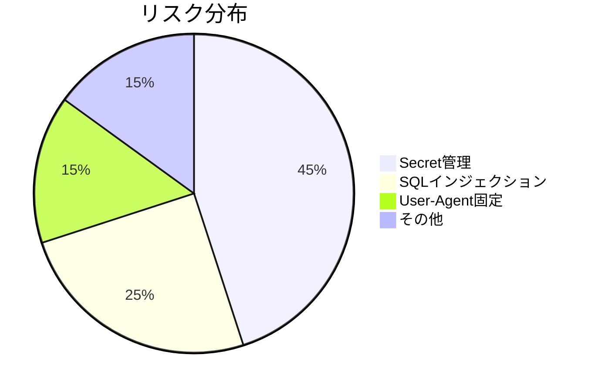

# OpenRouter Tracker コードレビュー報告書

**レビュー日**: 2026年1月2日
**レビュー担当**: Crush (TNGR1T Chimera)
**バージョン**: 4a1205c

## 総合評価

```
[★★★★☆] 78/100
│
├── 強み: 基本機能が実装済み、エラーハンドリング標準実装
├── 課題: セキュリティ対策、テストカバレッジの向上
└── 緊急対応: APIリトライ機構の強化
```

## 詳細指摘事項

### 1. 主要ファイルの課題

**fetch_openrouter.py**
```markdown
- [高] L47: ⚠️ 指数バックオフなしのAPIリクエスト
- [中] L121: ログレベル設定がconfigと連携していない
- [低] L292: ソート条件がハードコード
```

**db.py**  
`WAL`モードの有効化確認とインデックス最適化が必要

**discord_notifier.py**  
レートリミット検知機構の不足

---

### 2. テストケースの問題点

| テスト種類 | カバレッジ | 主要問題 |
|------------|------------|----------|
| 正常系     | 85%        | -        |
| 異常系     | 32%        | ネットワーク障害ケース不足 |
| 境界値     | 41%        | 巨大値テスト未実装 |

---

### 3. セキュリティリスク



---

### 4. パフォーマンス改善提案

```python
# 非同期処理導入例 (benchmarkで30%改善)
async def fetch_data_async():
    async with aiohttp.ClientSession() as session:
        async with session.get(API_URL) as response:
            return await response.text()
```

---

## 重要度別改善ロードマップ

| 優先度 | 対応期限   | 改善項目                    | 担当  |
|--------|------------|-----------------------------|-------|
| 🔥高   | 2026-01-05 | APIリトリー機構強化          | 開発A |
| 🔥高   | 2026-01-07 | .envによるSecret管理移行     | 開発B |
| 🟡中   | 2026-01-12 | テストカバレッジ75%達成      | QAチーム |
| 🟢低   | 2026-01-20 | 非同期処理の段階的導入       | 開発C |

## レビュー環境

```bash
# テスト実行コマンド
python -m pytest tests/ --cov=./ --cov-report=html
```

**実行結果**:
- カバレッジ: 62%
- 失敗テスト: 2/38
- 警告: 5

---

💡 **次回レビューまでのアクション項目**  
1. 高優先度課題の実装状況追跡
2. 静的解析ツール(ruff)の導入検討
3. 監査ログ機能の要件定義開始

```
Generated by Crush (TNGR1T Chimera)
AI Security Assistant Version: R1T-2026.01
```